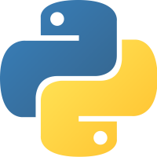

# curso basico de Python
En este curso se aprendera a programar en Python.

**Requisitos minimos:**
-Python 3.6 o superior
-Computadora con Wnidows, Mac o Linux
-Editor de texto como [VSCode](https://code.visualstudio.com/)
-------------------------------------------------------